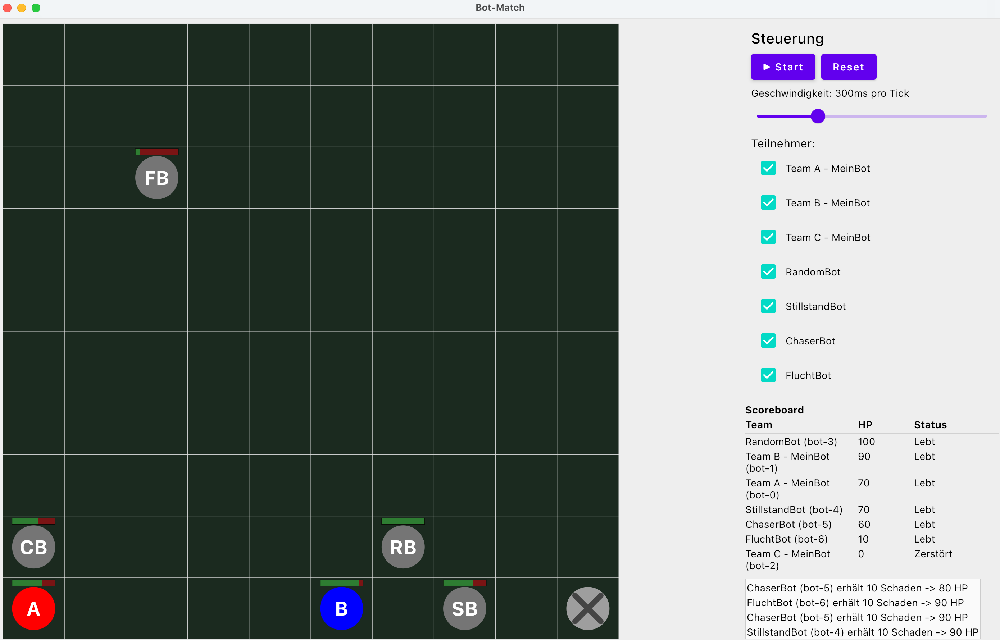

# Bot-Match — 3-Tage-Kotlin-Praktikum

Kotlin/Compose-Desktop-Projekt für ein Schülerpraktikum: Roboter kämpfen auf einem 10×10-Raster gegeneinander. Schüler schreiben ausschließlich Bot-Entscheidungslogik (`RobotBrain.decide()`), das komplette Framework (Engine, Rendering, Kampf-Regeln) ist fertig.



# Für Schüler: eigenen Bot bauen

Anleitung mit Beispielen, wie ihr euren Roboter steuert:
[`docs/schueler-framework-guide.md`](docs/schueler-framework-guide.md).
Kurzer Überblick über die wichtigsten Objekte als Klassendiagramm:
[`docs/modell-uebersicht.md`](docs/modell-uebersicht.md).

Kurzer Überblick zu Git/GitHub (nicht Teil dieses Praktikums, aber gut zu kennen):
[`docs/git-github-basics.md`](docs/git-github-basics.md).

## Projekt starten

Voraussetzung: JDK 17+ (JetBrains Runtime aus IntelliJ reicht), Internetzugang beim ersten Build (Gradle lädt Dependencies von Maven Central).

```bash
./gradlew run     # startet die Compose-Desktop-App
./gradlew test    # führt die Engine-Unit-Tests aus
./gradlew build   # kompiliert alles + führt Tests aus
```

In IntelliJ: Projektordner öffnen, Gradle-Import abwarten, dann `framework/Main.kt` → `main()` mit dem grünen Play-Button starten.

## Projektstruktur

```
src/main/kotlin/
  framework/arena/   Engine: Modelle, Spielregeln, Bot-Ausführung (fertig, nicht anfassen)
  framework/ui/       Compose-UI: Arena-Zeichenfläche, Scoreboard, Log, Steuerung (fertig)
  framework/Main.kt   Einstiegspunkt
  bots/examples/      Fertige Beispiel-Bots des Dozenten (Sparringspartner)
  bots/teama|b|c/      Hier schreiben die drei Schülerteams ihre Bots
src/test/kotlin/       Unit-Tests für die Engine
docs/                  Kursmaterial (Zeitplan, Backlog, Lösungen, Setup)
```

## Wie Schüler-Bots ins Spiel kommen

Jedes Team hat eine Datei unter `bots/teamX/TeamXBots.kt` mit einer Bot-Klasse und einer Liste `teamXBots`. Diese Listen werden zentral in [`framework/arena/BotRegistry.kt`](src/main/kotlin/framework/arena/BotRegistry.kt) zusammengeführt — der Dozent muss dafür keinen Schülercode ändern, nur ggf. die Registry erweitern, wenn ein Team mehrere Bot-Klassen anlegt.

Am Turniertag (Tag 3) integriert der Dozent alle drei Team-Ordner auf seinem Rechner (z.B. per Copy&Paste der Dateien oder USB-Stick) und startet das gemeinsame Finale.
