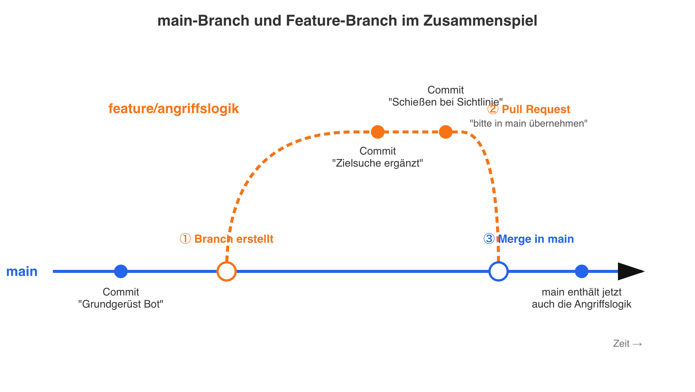

# Git & GitHub — kurz erklärt

Dieses Praktikum nutzt tatsächlich Git (siehe "So läuft es in unserem Praktikum
ab" weiter unten) — ein kurzer Überblick über die Grundbegriffe lohnt sich also
doppelt, weil euch Git/GitHub außerdem in fast jedem Programmier-Kontext wieder
begegnen werden. Diese Seite gibt nur die Grundidee, keine Detailtiefe.

## Warum überhaupt?

Stellt euch vor, ihr schreibt zu zweit an derselben Datei. Ohne Werkzeug dafür:
Ihr schickt euch die Datei ständig per USB-Stick oder E-Mail hin und her, überschreibt
euch gegenseitig Änderungen, und irgendwann weiß keiner mehr, welche Version die
aktuelle ist.

**Git** löst genau das Problem: Es speichert **jede Version** eures Codes, mit
genauem Zeitpunkt und Begründung ("was habe ich geändert und warum"). Ihr könnt
jederzeit zu einer älteren Version zurück, seht genau, wer was wann geändert hat,
und könnt sogar gleichzeitig an verschiedenen Ideen arbeiten, ohne euch gegenseitig
zu stören.

**GitHub** ist eine Webseite, die Git-Projekte online speichert und Teamarbeit
zusätzlich erleichtert (z.B. Diskussionen zu Änderungen, Übersicht über alle
Projekte, Backup in der Cloud). Man kann sich Git wie das Werkzeug und GitHub wie
den öffentlichen Aufbewahrungsort dafür vorstellen.

## Die vier wichtigsten Begriffe

### 1. Repository ("Repo")

Ein Repository ist einfach **ein Projektordner, den Git überwacht**. Git merkt sich
darin die komplette Geschichte aller Änderungen — wie ein Ordner mit eingebauter
Zeitmaschine.

### 2. Commit

Ein Commit ist ein **gespeicherter Schnappschuss** eures Codes zu einem bestimmten
Zeitpunkt, zusammen mit einer kurzen Nachricht, die erklärt, was sich geändert hat.

Beispiel: Ihr habt gerade die Flucht-Logik in eurem Bot fertiggestellt. Dann macht
ihr einen Commit mit der Nachricht `"Bot flieht jetzt bei HP < 20"`. Später könnt
ihr immer genau zu diesem Punkt zurückspringen, falls etwas kaputtgeht.

Faustregel: **kleine, oft gemachte Commits mit klarer Nachricht** sind besser als
ein riesiger Commit am Ende des Tages mit der Nachricht `"Änderungen"`.

### 3. Branch

Ein Branch ("Zweig") ist eine **eigene, abgezweigte Kopie** des Projekts, in der ihr
etwas ausprobieren könnt, ohne die Hauptversion (meist `main` genannt) zu verändern.

Analogie: Stellt euch einen Baumstamm vor (`main` — die stabile, funktionierende
Version). Ein Branch ist ein Ast, der vom Stamm abzweigt. Ihr könnt auf diesem Ast
wild herumprobieren — geht etwas schief, hat das keine Auswirkung auf den Stamm.
Funktioniert die Idee, könnt ihr den Ast später wieder mit dem Stamm zusammenführen
("mergen").

Typischer Ablauf: Neuer Branch `angriffslogik` → dort die Angriffslogik entwickeln
und testen → wenn sie funktioniert, zurück in `main` übernehmen.

### 4. Pull Request (PR)

Ein Pull Request ist eine **Anfrage**: "Ich habe in meinem Branch etwas fertig
entwickelt — bitte schaut es euch an und übernehmt es in die Hauptversion (`main`)."

Das ist der Moment, an dem Teamkolleg:innen die Änderung vor der Übernahme
gegenlesen können (ähnlich dem "Review (Pair-Check)" auf unserem Scrum-Board) —
Fehler werden idealerweise entdeckt, bevor sie in der Hauptversion landen, nicht
danach.

## Die vier Begriffe im Zusammenspiel

```
Repository (Projektordner)
 └── main-Branch (stabile Version)
      └── euer Branch "angriffslogik" (eigener Ast zum Ausprobieren)
           ├── Commit 1: "Grundgerüst für Zielsuche"
           ├── Commit 2: "Schießen bei Sichtlinie ergänzt"
           └── Pull Request → Bitte in main übernehmen
```

## Der Ablauf als Bild: main, Branch, Merge

Der Baum-Vergleich von oben noch einmal als Zeitachse — `main` läuft
durchgehend nach rechts, der Feature-Branch zweigt kurz ab und wird am Ende
wieder zusammengeführt:



Die drei Schritte im Bild:

1. **Branch erstellen** — an einem bestimmten Commit auf `main` zweigt ihr ab
   (`git checkout -b angriffslogik`). Ab hier laufen `main` und euer Branch
   getrennt weiter.
2. **Commits auf dem Branch** — ihr arbeitet wie gewohnt (Datei ändern,
   Commit, Datei ändern, Commit), nur dass diese Commits erst mal nur auf
   eurem Branch existieren, nicht auf `main`.
3. **Merge über Pull Request** — ist der Branch fertig, öffnet ihr einen Pull
   Request. Nach dem Review werden alle Commits eures Branches in `main`
   übernommen (gemergt). `main` enthält danach alles, was vorher nur auf dem
   Feature-Branch war — der Branch selbst kann anschließend gelöscht werden,
   seine Commits bleiben in der Geschichte von `main` erhalten.

**Wichtig:** Während ihr auf eurem Branch arbeitet, bleibt `main` unverändert.
Andere Teammitglieder, die von `main` aus weiterarbeiten, sehen eure
Zwischenstände nicht, bis der Merge passiert ist — genau das macht es
möglich, parallel an verschiedenen Features zu arbeiten, ohne sich gegenseitig
kaputte Zwischenstände unterzuschieben.

## So läuft es in unserem Praktikum ab

Anders als der einfache `main`/Feature-Branch-Fall oben gibt es hier **einen
Basis-Branch pro Praktikums-Durchlauf** (nicht `main` selbst) und **einen
Branch pro Team**, der von diesem Basis-Branch abzweigt:

1. **Vor dem Praktikum** legt der Dozent einen Basis-Branch für diesen
   Durchlauf an, z.B. `student-2026_07` (Namensschema: Jahr_Monat des
   Termins — für jeden neuen Praktikums-Termin ein neuer Basis-Branch).
2. **Am Anfang** erstellt jedes Team über IntelliJ einen eigenen Branch von
   diesem Basis-Branch aus, benannt nach Team-Kürzel: `student-2026_07-A`,
   `student-2026_07-B`, `student-2026_07-C`.
3. **Während der Arbeit** committet und pusht jedes Team seinen Fortschritt
   selbst, sobald eine Story fertig ist — nicht erst ganz am Ende. So bleibt
   der eigene Branch (`student-2026_07-A` etc.) laufend aktuell und nichts
   geht verloren.
4. **Am Ende des Tages** öffnet jedes Team einen Pull Request von seinem
   Team-Branch zurück auf den Basis-Branch (`student-2026_07`) — das
   übernimmt in der Praxis meist der Dozent, damit alle drei Teams
   zuverlässig und zur gleichen Zeit gemergt werden.
5. Sind alle drei Pull Requests gemergt, enthält der Basis-Branch
   `student-2026_07` den Stand aller drei Teams zusammen — genau darauf
   lässt sich am Ende des Tages das gemeinsame Testduell/Battle-Royale
   starten.

Am nächsten Tag geht es auf dem eigenen Team-Branch weiter (der lebt über
alle drei Tage), bis am letzten Tag der finale Merge aller drei Branches in
`student-2026_07` das Turnier-Finale vorbereitet.

```
student-2026_07 (Basis-Branch für diesen Durchlauf)
 ├── student-2026_07-A ── Commits von Team A, täglich gepusht
 ├── student-2026_07-B ── Commits von Team B, täglich gepusht
 └── student-2026_07-C ── Commits von Team C, täglich gepusht
      └── Pull Request je Team, am Ende jedes Tages → zurück nach student-2026_07
```

## Wenn ihr selbst ausprobieren wollt

Ein guter, kostenloser nächster Schritt außerhalb des Praktikums:
[github.com](https://github.com) einen Account anlegen und ein eigenes kleines
Projekt hochladen. GitHub selbst bietet dafür eine kurze interaktive Einführung
("Hello World"-Guide), die genau diese vier Begriffe an einem echten Mini-Beispiel
durchspielen lässt.
